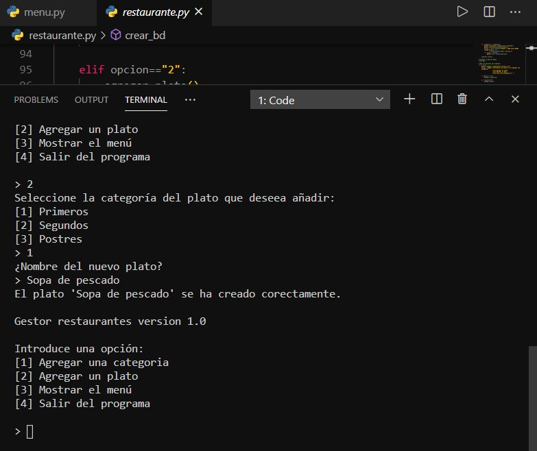
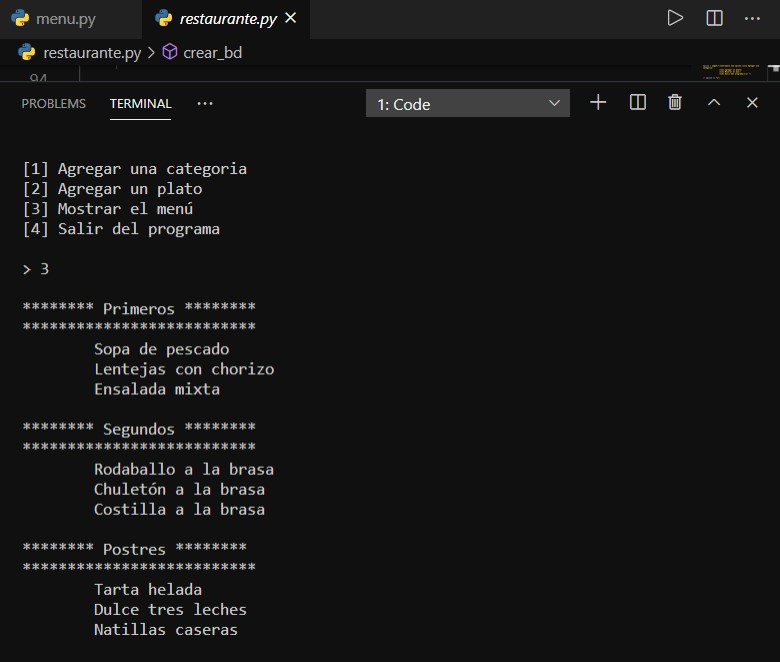
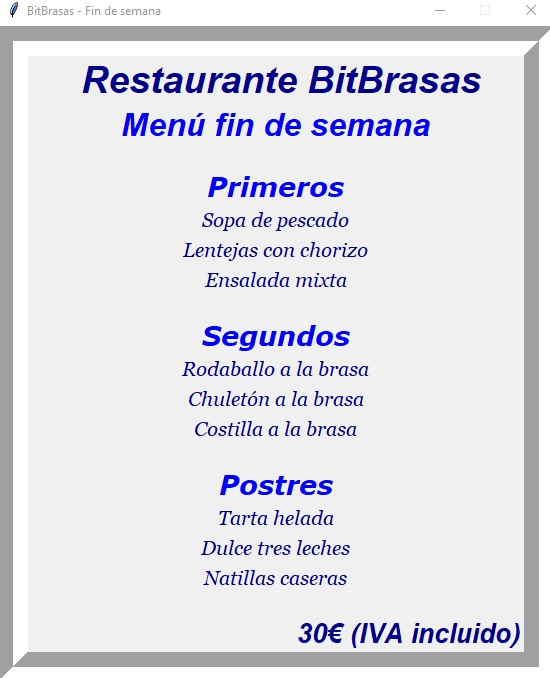

## Menú de restaurante con tkinter

Utilizando **Python**, el archivo restaurante.py crea una base de datos *restaurante* con **SQLite3** y por consola se muestra un menú desde el que se pueden añadir categorías y platos.

Se puede mostrar por consola el contenido del menú del Restaurante.

El archivo menu.py utiliza **tkinter** para crear una interfaz gráfica y mostrar el menú en una ventana.

